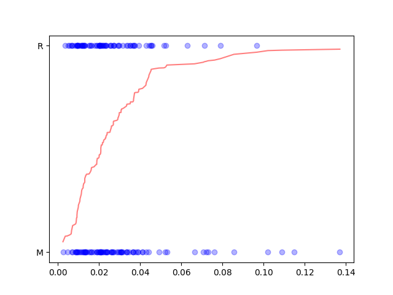

# nissank-regression

A simple logistic regression based classifier for sonar data

## Improvements in v2

- Re-arranged your directory structures to leverage **seperation of concerns** - the quality of projects where folders, files and code are seperated into distinct parts depending _on their task_.

- **Added comments** to help with code readability

- Updated variable names to snake case whereever applicable. For example, the following code:

  ```python
  sonardata = pd.read_csv("sonar data.csv", header=None)
  ```

  is updated to:

  ```python
  sonar_data = pd.read_csv("data/sonar_data.csv", header=None)
  ```

- Added **constants** (e.g. `CLASS_COLUMN_INDEX = 60`) wherever applicable.

- Removed redundant `groupby` function call:

  ```python
  sonar_data.groupby(CLASS_COLUMN_INDEX).mean()
  ```

- Increase test split to 20% (0.2) - i.e. training split to 80% - following general machine learning principles for better validation.

- Used simple letters (i.e. `x`, `y`) for prediction vectors and capital letters (i.e. `X`, `Y`) for actual vectors.

- Moved all outputs (i.e. `print` statements) to the end (i.e. seperation of concerns)

- Added code for plotting the logistic regression curve:
  ```python
  X_plot = X_train[0].sort_values()
  plt.scatter(X_plot, Y_train, color="blue", alpha=0.3)
  X_pred = model.predict_proba(X_train)[:, 0]
  X_pred.sort()
  plt.plot(X_plot, X_pred, color="red", alpha=0.5)
  plt.savefig("plot.png")
  ```
  
